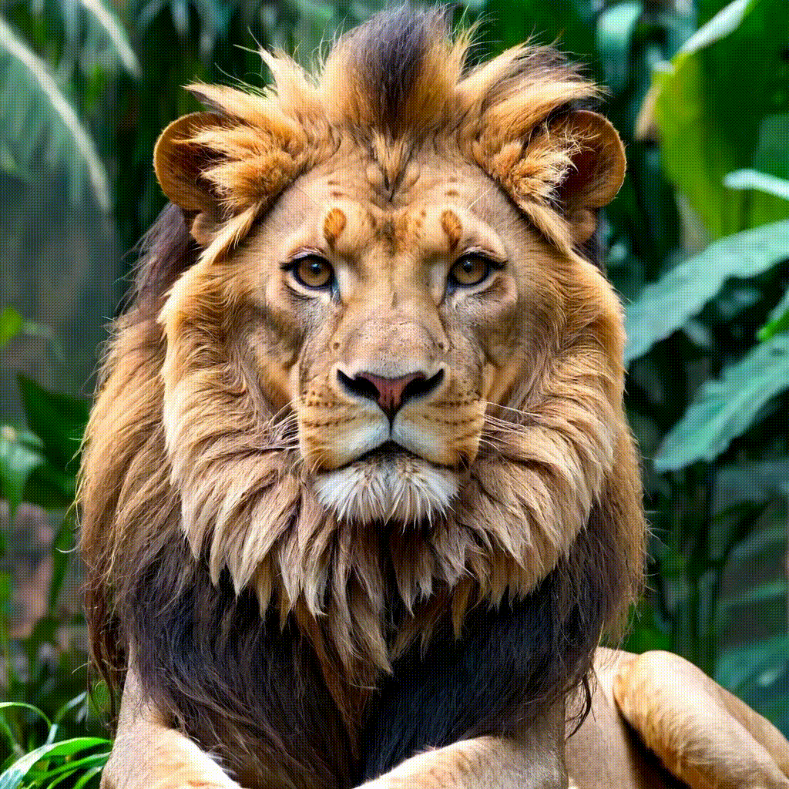

# img-and-audio2video Cog model

This is acustom model of combining an image and audio into a video, as a Cog model. [Cog packages machine learning models as standard containers.](https://github.com/replicate/cog)

Run a prediction:

    cog predict -i image=@replicate.png -i audio=@demo.mp3

## Example Output

Example output for prompt: "masterpiece, high quality, ultra good, this is the good stuff, best prompt ever, portrait of a woman, freckles, ginger"

